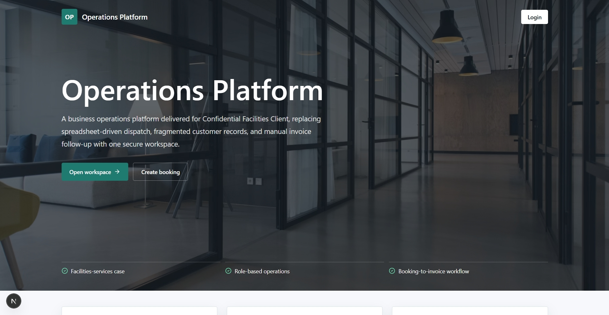
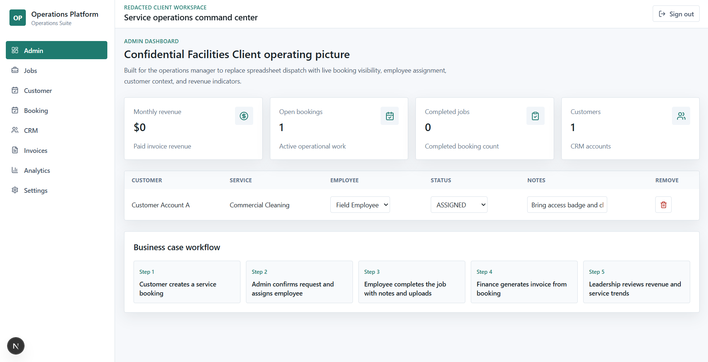
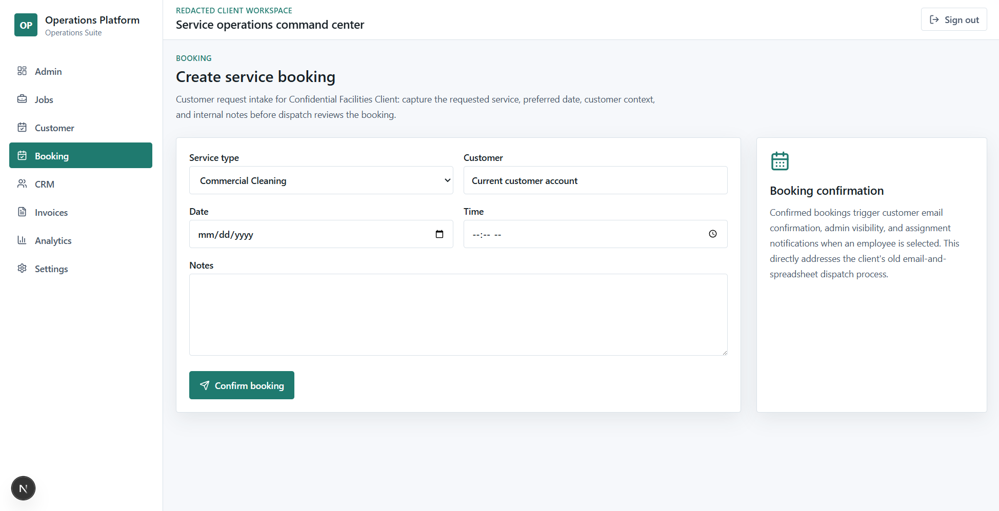
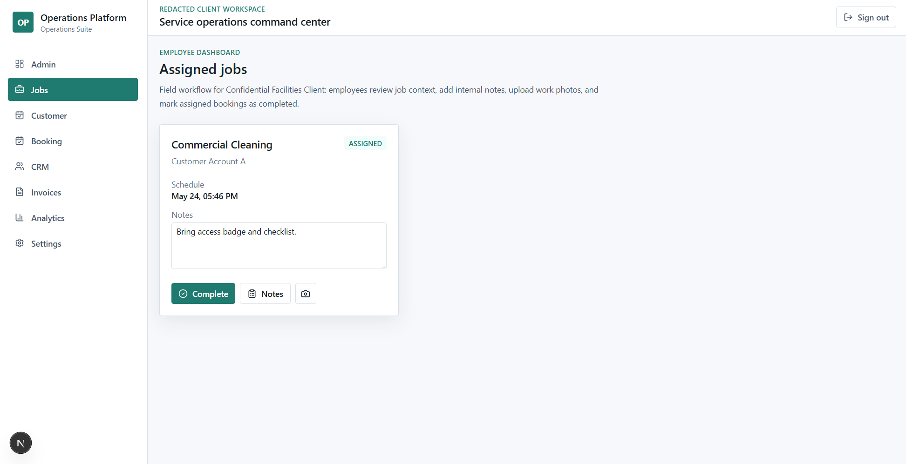
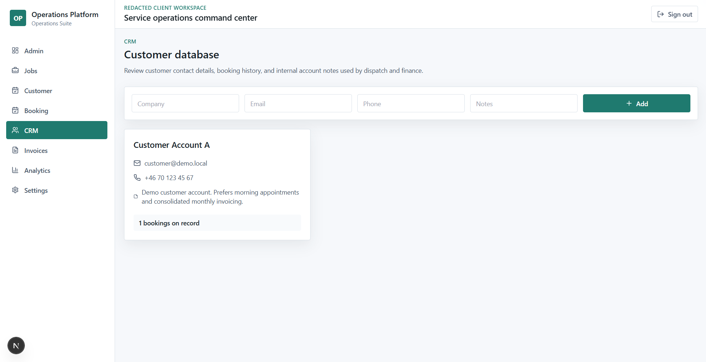
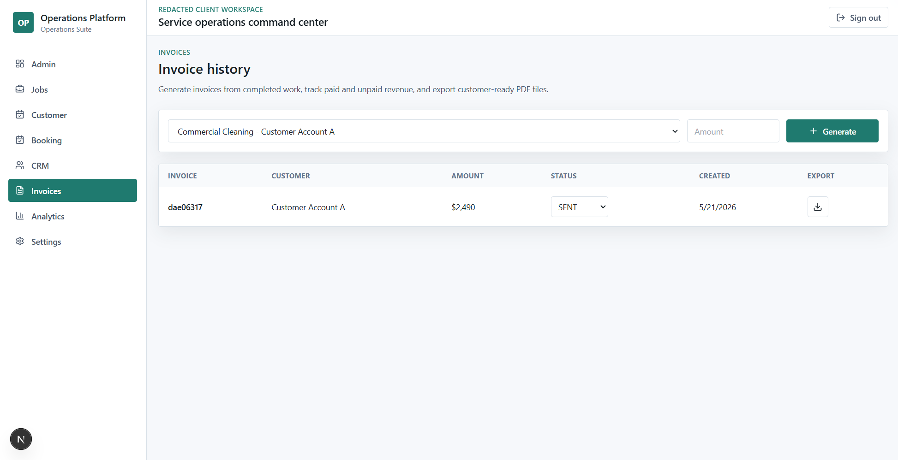
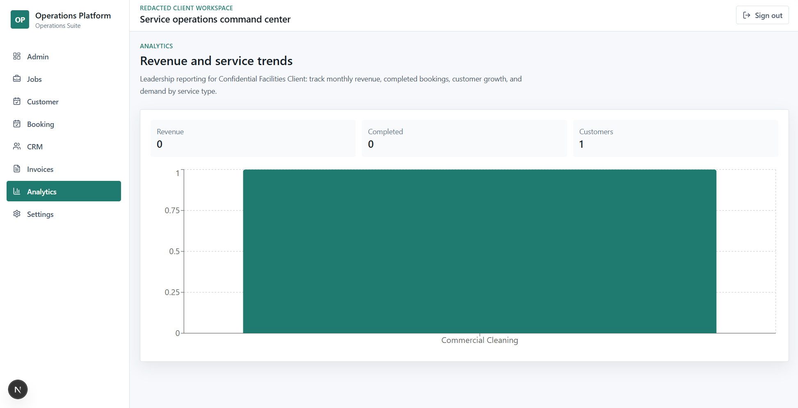

# Confidential Operations Platform

This is a production-grade fullstack business management platform built for a **confidential facilities-services client** during consulting work. The public demo uses redacted company names while preserving the real product scope: replace fragmented spreadsheets, email dispatching, manual invoice tracking, and disconnected customer records with one secure operations platform.

It includes JWT authentication, role-based dashboards, booking workflows, CRM records, invoicing, analytics, uploads, notifications, Dockerized infrastructure, CI, and automated tests.

## Business Case

The client manages cleaning, HVAC maintenance, emergency repairs, and inspections for commercial customers. Before this platform, the company had no reliable single source of truth for bookings, employee assignment, job completion, customer history, or revenue reporting.

The platform delivers the client solution:

- Customers book services and track request status.
- Admins assign employees and monitor unassigned or delayed work.
- Employees view assigned jobs, add notes, upload evidence, and mark work complete.
- Finance generates invoices from completed bookings and tracks payment state.
- Leadership reviews monthly revenue, completion volume, customer growth, and service trends.

Detailed case documentation lives in [docs/business-case.md](docs/business-case.md).

## Architecture

- `apps/web`: Next.js, TypeScript, Tailwind CSS, App Router UI
- `apps/api`: Node.js, Express, Prisma, PostgreSQL, JWT auth
- `apps/api/prisma`: database schema and seed data
- `.github/workflows/ci.yml`: install, typecheck, lint, test, and build pipeline
- `docker-compose.yml`: PostgreSQL, API, and frontend services

## Core Capabilities

- Admin, employee, and customer roles
- Access and refresh token authentication
- Protected API routes and role permissions
- Booking creation, assignment, lifecycle tracking, and notes
- CRM customer records and booking history
- Invoice generation, payment status tracking, and PDF export endpoint
- Realtime-ready notification model with Socket.IO wiring
- Receipt, document, and work photo uploads
- Analytics for revenue, completed bookings, customer growth, and service trends
- Dark mode-ready design tokens

## Quick Start

```bash
cp .env.example .env
npm install
npm run prisma:generate
npm run prisma:migrate
npm run seed
npm run dev
```

The web app runs at `http://localhost:3000` and the API runs at `http://localhost:4000`.

## Docker

```bash
cp .env.example .env
docker compose up --build
```

## Workspace Accounts

| Role | Email | Password |
| --- | --- | --- |
| Admin | admin@demo.local | Password123! |
| Employee | employee@demo.local | Password123! |
| Customer | customer@demo.local | Password123! |

## API Overview

All protected endpoints require `Authorization: Bearer <accessToken>`.

| Method | Path | Description |
| --- | --- | --- |
| POST | `/auth/register` | Create a user and customer profile when needed |
| POST | `/auth/login` | Login and receive access and refresh tokens |
| POST | `/auth/refresh` | Rotate an access token |
| POST | `/auth/reset-password/request` | Start password reset flow |
| POST | `/auth/reset-password/confirm` | Complete password reset |
| POST | `/bookings` | Create a customer booking |
| GET | `/bookings` | List role-scoped bookings |
| PATCH | `/bookings/:id` | Update status, assignment, or notes |
| DELETE | `/bookings/:id` | Cancel/delete a booking |
| GET | `/customers` | List customers |
| POST | `/customers` | Create a CRM customer |
| GET | `/invoices` | List invoices |
| POST | `/invoices` | Generate invoice |
| GET | `/analytics/overview` | Dashboard analytics |
| POST | `/upload` | Upload booking files |

## Testing

```bash
npm run test
npm run typecheck
npm run lint
```

API tests use Jest and Supertest. End-to-end booking flow coverage lives in `apps/web/cypress/e2e/booking-flow.cy.ts`.

## Deployment

The platform is ready for deployment to a VPS, Render, Railway, or DigitalOcean. Configure environment variables from `.env.example`, provision PostgreSQL, run Prisma migrations, then deploy the API and web containers.

## Screenshots

| Dashboard | Admin |
| --- | --- |
|  |  |

| Booking | Employee |
| --- | --- |
|  |  |

| CRM | Invoices |
| --- | --- |
|  |  |

| Analytics |
| --- |
|  |
